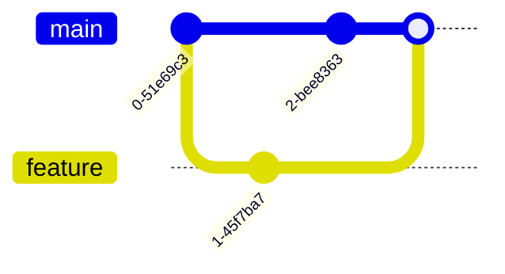

# 1. Setting Up

Starting a repository

---

# git init & git clone

Start a new project or copy an existing one.

### New Project (`git init`)

Turns the current directory into a Git repository.

```bash
mkdir my-project
cd my-project
git init
# Creates a hidden .git/ folder

```

### Existing Project (`git clone`)

Downloads a repository from a remote server (like GitHub).

```bash
git clone https://github.com/user/repo.git
# Automatically sets up remote tracking

```

---

# 2. The Three States

Understanding how Git tracks files.

### The Zones

1. **Working Directory**: Where you edit files.
2. **Staging Area (Index)**: Where you prepare the snapshot.
3. **Repository (HEAD)**: Where changes are permanently stored.

### File Status

- **Untracked**: New files Git hasn't seen.
- **Tracked**:
- _Unmodified_: Clean.
- _Modified_: Changed but not staged.
- _Staged_: Ready to commit.

::right::

<div class="ml-4 mt-10">


</div>

---

# Staging Changes

Moving from "Modified" to "Staged".

### Check Status

Always check status before adding!

```bash
git status

```

### Add Files

```bash
# Stage a specific file
git add filename.txt

# Stage all changes (new, modified, deleted)
git add .

```

---

# Committing

Saving the snapshot to history.

A commit captures the state of the Staging Area.

```bash
# Commit with a message
git commit -m "Add login feature"

# Add and Commit in one step (skips untracked files)
git commit -am "Fix typo in header"

```

> **Best Practice:** Write clear, concise commit messages. Use the imperative mood ("Fix bug" not "Fixed bug").

---
layout: section
---

# 3. Inspecting History

Seeing what happened

---

# git log & git diff

### Viewing History (`git log`)

```bash
# Standard log
git log

# One line summary (cleaner)
git log --oneline --graph --all

```

### Viewing Changes (`git diff`)

```bash
# Diff Working Directory vs Staging (What have I changed but not added?)
git diff

# Diff Staging vs Repository (What am I about to commit?)
git diff --staged

```

---
layout: section
---

# 4. Undoing Things

"I made a mistake"

---

# Unstaging & Restoring

### Unstage Changes

You added a file to staging by mistake, but want to keep the changes in the file.

```bash
# Removes file from Staging, keeps it in Working Directory
git restore --staged <file>
# OR (older syntax)
git reset HEAD <file>

```

### Discard Changes

You messed up a file and want to revert it to the last commit state (Dangerous!).

```bash
# Discards changes in Working Directory
git restore <file>
# OR (older syntax)
git checkout -- <file>

```

---

# .gitignore

**Essential Topic:** Telling Git what _not_ to track.

Create a file named `.gitignore` in your root.

```text
# .gitignore example

# Ignore node_modules
node_modules/

# Ignore env files with secrets
.env

# Ignore build artifacts
dist/
build/

```

---
layout: section
---

# 5. Branching

Parallel Development

---

# Branching Basics

Branches allow you to work on features isolated from the main code.

```bash
# List branches
git branch

# Create a new branch
git branch feature-login

# Switch to a branch
git switch feature-login
# OR
git checkout feature-login

# Create AND switch
git checkout -b feature-login

```

---
layout: section
---

# 6. Remote & Auth

Working with GitHub

---

# Auth with GitHub

Modern GitHub requires **SSH Keys** or **Personal Access Tokens (PAT)**. Password auth is deprecated.

### Recommended: SSH

1. Generate key: `ssh-keygen -t ed25519 -C "email@example.com"`
2. Add public key (`id_ed25519.pub`) to GitHub Settings -> SSH Keys.
3. Test: `ssh -T git@github.com`

### Linking Remote

```bash
# Add a remote named 'origin'
git remote add origin https://github.com/user/repo.git

# Verify
git remote -v

```

---

# Push, Fetch & Pull

### Push

Upload local commits to remote.

```bash
# First push (set upstream)
git push -u origin main

# Subsequent pushes
git push

```

### Fetch vs Pull

- **Fetch**: Downloads data from remote but does **not** change your files.

```bash
git fetch

```

- **Pull**: Fetches **AND** Merges immediately.

```bash
git pull

```

---
layout: section
---

# 7. Integration

Merge vs Rebase

---

## layout: two-cols

# Merge vs Rebase

### Merge

```bash
git checkout main
git merge feature-branch
```

✅ Non-destructive  
❌ Messy history

### Rebase

```bash
git checkout feature-branch
git rebase main
```

✅ Clean, linear history  
❌ Rewrites history (shared branches)

::right::

<div class="ml-4">

**Merge:**



**Rebase:**
Moves the feature commits to be played _after_ the latest main commit.

</div>

---

# Conflicts

When Git gets confused.

Occurs when the same line is modified in two different branches.

1. Git pauses the merge/rebase.
2. Open files; look for markers:

```text
&lt;&lt;&lt;&lt;&lt; HEAD
Current Change
=======
Incoming Change
&gt;&gt;&gt;&gt;&gt; feature-branch

```

1. Edit file to choose the correct code.
2. **Add** the file.
3. **Commit** (or `git rebase --continue`).

---
layout: section
---

# 8. Advanced Tools

Stash & Worktrees

---

# Git Stash

"Save it for later."

Useful when you are not ready to commit but need to switch branches.

```bash
# Save changes to a temporary stack
git stash

# List stashes
git stash list

# Apply the last stash and remove it from stack
git stash pop

# Apply but keep in stack
git stash apply

```

---

# Git Worktrees

**Pro Tip:** Working on multiple branches simultaneously.

Instead of switching branches (which changes your files), check out a branch into a _separate folder_.

```bash
# Create a new folder linked to a specific branch
git worktree add ../new-folder-name feature-branch

# List worktrees
git worktree list

# Remove worktree
git worktree remove ../new-folder-name

```

- Useful for fixing a hot-fix bug while in the middle of a massive feature refactor.
